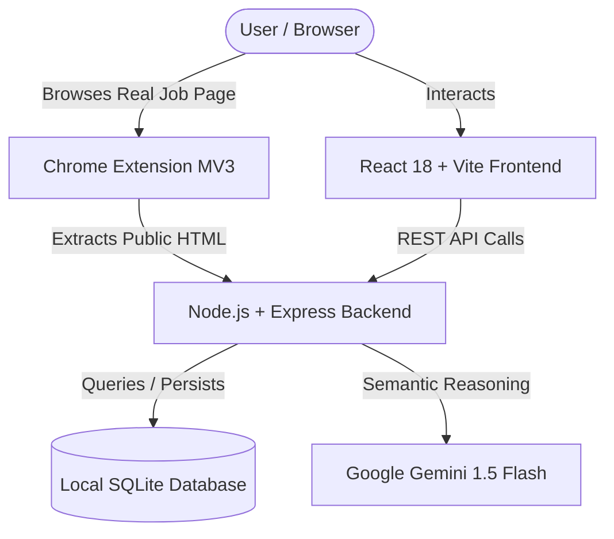

# JobPilot AI Architecture & Engineering Specification

## 1. Executive Summary & Design Principles

**JobPilot AI** is an end-to-end intelligent candidate copilot built with strict authenticity guarantees:
- **Never Fabricate Experience**: The system reorders, summarizes, highlights, and optimizes wording, but strictly enforces that unverified technologies or qualifications (RED in Truth Check) are NEVER fabricated or injected into candidate resumes.
- **Transparent Scoring**: Match scores are computed via deterministic, weighted heuristics combined with LLM evaluations rather than opaque black-box numbers.
- **True Resiliency & Free-Tier First**: JobPilot runs locally using pure WebAssembly SQLite (`sql.js`), Express, React, and Google Gemini 1.5 Flash (free tier), with graceful deterministic fallbacks if no API key is provided.

---

## 2. System Architecture



---

## 3. Matching & Scoring Methodology

The overall match score (0–100%) is computed across five deterministic dimensions:

$$\text{Overall Score} = 0.40 \cdot S_{\text{skill}} + 0.25 \cdot S_{\text{exp}} + 0.20 \cdot S_{\text{role}} + 0.10 \cdot S_{\text{loc}} + 0.05 \cdot S_{\text{seniority}}$$

### A. Technical Skill Alignment ($S_{\text{skill}}$)
Calculated via the **Truth Check Engine**:
- **GREEN (Confirmed Match)**: 100% weight per item.
- **YELLOW (Transferable/Adjacent)**: 60% weight (e.g. TestNG ↔ JUnit, Selenium ↔ Playwright).
- **RED (Missing from Profile)**: 0% weight.
$$\text{Skill Score} = \min\left(100, \left[\frac{\text{Green} \times 1.0 + \text{Yellow} \times 0.6}{\text{Total Required Skills}}\right] \times 100\right)$$

### B. Experience Fit ($S_{\text{exp}}$)
Compares candidate's verified years of experience against the required years in the job description:
- Exceeds / Meets Requirement: Starts at 90% and scales up to 100%.
- Deficit: Subtracts 15% per missing year down to a baseline floor of 40%.

### C. Target Role Fit ($S_{\text{role}}$)
Evaluates domain and career track alignment:
- **Same Track** (e.g. QA Automation $\rightarrow$ QA Automation): 96%
- **Cross-Track** (e.g. QA $\rightarrow$ Java Backend): 58% with transition guidance.

### D. Location Fit ($S_{\text{loc}}$)
- 98% if remote, hybrid match, or location aligns with candidate preferences.
- 72% for location mismatch without remote options.

### E. Seniority Level ($S_{\text{seniority}}$)
Weighted composite:
$$S_{\text{seniority}} = 0.70 \cdot S_{\text{exp}} + 0.30 \cdot S_{\text{role}}$$

---

## 4. Match Categories
- **90–100%**: Strongly Recommended (Emerald)
- **75–89%**: Recommended (Blue)
- **50–74%**: Review Required (Amber)
- **< 50%**: Not Recommended (Rose)

---

## 5. Candidate Truth Check & Resume Tailoring

```
Master Candidate Profile (Immutable Truth)
                +
Target Job Description
                ↓
      [ Truth Check Engine ]
   ├── GREEN:  Confirmed skills
   ├── YELLOW: Adjacent/related tools
   └── RED:    Missing unverified skills (STRICTLY OMITTED)
                ↓
    [ Resume Tailor Service ]
   ├── Reorders matched skills to top
   ├── Prioritizes job-relevant bullet points
   ├── Synthesizes targeted professional summary
   └── Preserves versioning history (e.g. HCL_QA_v1)
```

---

## 6. Estimated ATS Match Simulation

JobPilot analyzes:
1. **Keyword Match Index**: Proportion of verified job keywords surfaced in headings and bullet points.
2. **Formatting Compliance**: Verified single-column standard typography.
3. **Readability & Scanning Score**: Density of action verbs and quantified impact metrics.

*Disclaimer: JobPilot simulates standard parser heuristics and never claims to reproduce proprietary employer algorithms.*
