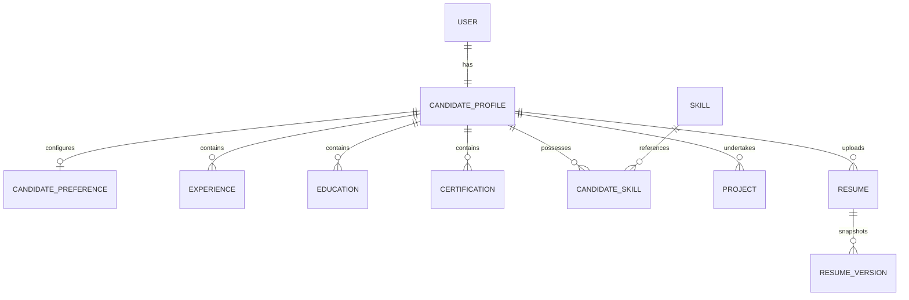

# Architecture: Candidate Profile & Canonical Truth Foundation

## 1. Executive Summary
In Pilot Mama, the candidate's verified profile is the **Canonical Single Source of Truth**. The system adheres strictly to the **Anti-Fabrication and Truth Protection Principle**:
- Automated parsers extract raw and structured draft representations.
- Extracted information is presented to the candidate in a **Candidate Review Workflow**.
- Candidate confirmation commits validated fields into the candidate's structured profile.
- Previous states can be captured as **Immutable Resume Versions** for historical auditing and job applications.

---

## 2. Domain Data Model

### Key Entities
1. **`CandidateProfile`**:
   - Identity: `fullName`, `headline`, `phone`, `email`, `location`, `country`, `city`, `stateProvince`, `postalCode`, `summary`.
   - Links: `linkedinUrl`, `githubUrl`, `portfolioUrl`.
2. **`CandidatePreference`**:
   - Target Roles, Preferred Locations, Preferred Countries, Remote Preference (`REMOTE`, `HYBRID`, `ONSITE`, `ANY`), Employment Type, Salary Range (`minSalary`, `maxSalary`, `currency`), Notice Period, Relocation Willingness.
3. **`Experience`**:
   - Company, Job Title, Location, Employment Type, Start Date, End Date, `isCurrent`, Responsibilities, Achievements, Technologies, Display Order.
   - Enforces strict chronology (End date cannot precede Start date; current jobs cannot have an end date).
4. **`CandidateSkill` & Normalized `Skill`**:
   - Normalized skill catalog prevents taxonomy fragmentation.
   - Preserves source (`MANUAL`, `RESUME`, `IMPORTED`).
   - Strict Anti-Fabrication: Years of experience are only stored if explicitly stated on the source document (e.g., "Java - 6 years").
5. **`Resume`**:
   - Source document representation with status tracking (`UPLOADED`, `PARSING`, `PARSED`, `PARSE_REVIEW_REQUIRED`, `FAILED`, `ARCHIVED`).
6. **`ResumeVersion`**:
   - Immutable snapshot of candidate profile state at a discrete point in time. Changing current profile data does not mutate past versions.

---

## 3. Endpoints & Authorization

All endpoints reside under `/api/v1` and strictly enforce ownership derived from JWT tokens (`req.user.userId`):

| Method | Endpoint | Description |
|---|---|---|
| `GET` | `/api/v1/candidates/me` | Fetch authenticated candidate's canonical profile |
| `PATCH` | `/api/v1/candidates/me` | Update candidate profile details |
| `GET` | `/api/v1/candidates/me/preferences` | Retrieve candidate preferences |
| `PATCH` | `/api/v1/candidates/me/preferences` | Update candidate preferences |
| `GET` / `POST` | `/api/v1/candidates/me/experiences` | List / Add work experiences |
| `PATCH` / `DELETE` | `/api/v1/candidates/me/experiences/:id` | Update / Delete work experience |
| `GET` / `POST` | `/api/v1/candidates/me/educations` | List / Add education records |
| `PATCH` / `DELETE` | `/api/v1/candidates/me/educations/:id` | Update / Delete education record |
| `GET` / `POST` | `/api/v1/candidates/me/skills` | List / Add normalized skills |
| `DELETE` | `/api/v1/candidates/me/skills/:id` | Remove candidate skill |
| `GET` / `POST` | `/api/v1/candidates/me/certifications` | List / Add certifications |
| `PATCH` / `DELETE` | `/api/v1/candidates/me/certifications/:id` | Update / Delete certification |
| `GET` / `POST` | `/api/v1/candidates/me/projects` | List / Add technical projects |
| `PATCH` / `DELETE` | `/api/v1/candidates/me/projects/:id` | Update / Delete technical project |
| `GET` / `POST` | `/api/v1/resumes` | List / Upload resume document |
| `GET` / `DELETE` | `/api/v1/resumes/:id` | Get resume metadata / Archive resume |
| `POST` | `/api/v1/resumes/:id/parse` | Parse uploaded resume document |
| `POST` | `/api/v1/resumes/:id/confirm` | Confirm parsed data into canonical profile |
| `GET` / `POST` | `/api/v1/resumes/:id/versions` | List / Create immutable resume versions |
| `GET` | `/api/v1/resume-versions/:id` | View immutable resume version snapshot |
